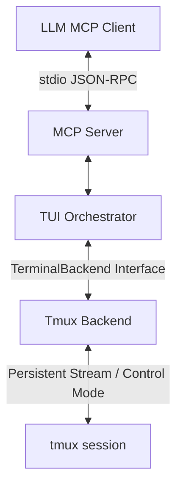
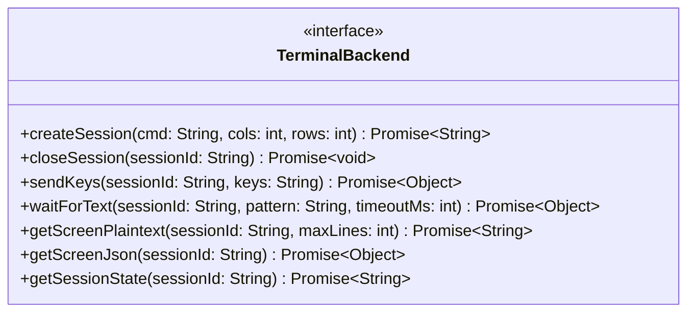

# High-Level Design: Core MCP & Unix Backend

## 1. Overview

`mcp-tuikit` bridges Large Language Models (LLMs) and Terminal User Interfaces (TUIs). It exposes terminal screen states as Model Context Protocol (MCP) resources and provides MCP tools to interact with running terminal sessions asynchronously.

## 2. System Architecture

The system consists of three primary layers driven by non-blocking, asynchronous event loops to prevent Node.js thread starvation:



## 3. Core Interfaces

The `TerminalBackend` contract mandates asynchronous operations, session state management, and strict error handling.



## 4. MCP Resources & Tools

Resources support pagination and limits to restrict context size. Tools return immediate visual feedback.

```yaml
resources:
  - uri: 'terminal://session/{id}/screen.txt?maxLines={limit}'
    name: 'Terminal Screen (Plaintext)'
    description: 'Visible terminal buffer. Supports line truncation to avoid context overflow.'
    mimeType: 'text/plain'

  - uri: 'terminal://session/{id}/screen.json'
    name: 'Terminal Screen (JSON)'
    description: 'Buffer with cursor position, dimensions, and session state (alive, blocked).'
    mimeType: 'application/json'

tools:
  - name: send_keys
    description: 'Send keystrokes asynchronously. Returns the immediate next screen state.'
    parameters:
      type: object
      properties:
        session_id: { type: string }
        keys: { type: string }
      required: [session_id, keys]

  - name: wait_for_text
    description: 'Wait for specific text via event-driven stream matching. Prevents race conditions.'
    parameters:
      type: object
      properties:
        session_id: { type: string }
        pattern: { type: string }
        timeout_ms: { type: integer, default: 5000 }
      required: [session_id, pattern]
```

## 5. Tmux Orchestration & Session Lifecycle

- **Persistent Streams:** Instead of spawning short-lived CLI processes per request, the backend attaches to the session via a persistent child process (e.g., tmux Control Mode or streamed pseudo-terminal). This dramatically improves I/O performance.
- **Headed Mode (Debug):** By default, sessions run entirely headless. However, if the environment variable `TUIKIT_HEADED=1` is set, the server will additionally launch a visible terminal window (e.g., via `x-terminal-emulator`, `gnome-terminal`, or `open -a Terminal`) that automatically attaches to the `tmux` session. This allows developers to visibly observe the LLM interacting with the TUI in real-time.
- **Lifecycle Management:** Sessions are explicitly tracked. `closeSession` guarantees cleanup by sending `SIGTERM`/`SIGINT` to child processes and issuing `tmux kill-session`, preventing zombie processes.
- **Graceful Shutdown (Orphan Prevention):** The MCP server must register process-level listeners (`SIGINT`, `SIGTERM`, `exit`, `uncaughtException`) to automatically invoke `closeSession` for all tracked active sessions before the Node.js process terminates. This ensures no detached `tmux` sessions remain hanging if the LLM agent is stopped abruptly.
- **Error Handling:** Operations wrap executions in `try/finally` blocks, ensuring background streams and timers are cleared. The system throws strongly-typed errors (`TimeoutError`, `TmuxExecutionError`) for explicit failure contexts.

## 6. Race Condition Mitigation (`wait_for_text`)

To mitigate TUI asynchronous rendering:

1. **Event-Driven Matching:** The system monitors the persistent output stream of the terminal, evaluating the regex pattern against incoming chunks in real-time.
2. **Fallback Polling:** If streaming is unavailable, the system uses non-blocking `setTimeout` with `async/await` to poll the screen state, preventing event-loop starvation.
3. **Completion Detection:** When possible, shell prompt markers are utilized alongside text matching to reliably detect command completion.
4. **Timeouts:** If the pattern is not matched within the timeout threshold, the operation throws a `TimeoutError`, allowing the LLM to recover.
