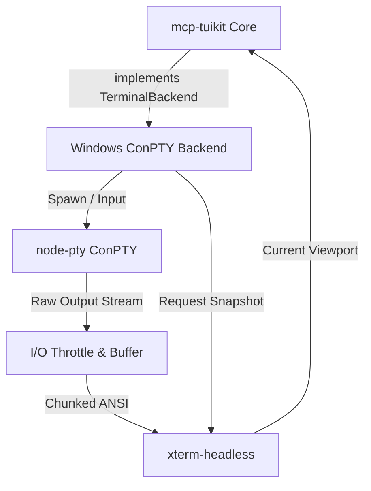

# High-Level Design: Windows ConPTY Backend

## 1. Overview
This document outlines the architecture for the Windows terminal backend in `mcp-tuikit`, fulfilling Story #7 of Epic #6. Since Windows lacks a native `tmux capture-pane` equivalent, this backend relies on Windows Pseudo Console (ConPTY) to spawn processes and a virtual screen buffer to maintain state.

## 2. Boundaries and Responsibilities
The system is divided into two primary logical components:
*   **Process Manager (`node-pty` wrapper):** Responsible for process lifecycle (spawn, kill, resize) and raw I/O streaming via the ConPTY API.
*   **Virtual Screen State (`xterm-headless`):** An in-memory terminal emulator that ingests raw ANSI streams to maintain a 2D text and attribute grid, ensuring cursor and text grid parity with a real terminal.

Both components are orchestrated by a class that implements the standard `TerminalBackend` interface.

## 3. Integration Strategy (`node-pty`)
*   The backend will instantiate a `node-pty` instance specifically configured for Windows (`useConpty: true`).
*   **Headed Mode (Debug):** While `node-pty` is naturally headless, if the environment variable `TUIKIT_HEADED=1` is set, the backend will spawn a visible host terminal window (e.g., via `cmd /c start ...` or `wt.exe`) mirroring or attaching to the process stream. This allows developers to visibly observe the agent's actions on Windows.
*   The backend maps `TerminalBackend` methods (e.g., `write`, `resize`) directly to the underlying `node-pty` instance.
*   The stdout stream from `node-pty` is piped exclusively into the Virtual Screen State component.

## 4. Buffering and Parsing Strategy
Without a native snapshot utility, the backend must continuously parse the stream to answer "what is on the screen right now".
*   **Stream Ingestion & Throttling:** Raw bytes are read asynchronously. To prevent `onData` bursts from blocking the Node event loop during heavy output, I/O events from `node-pty` are buffered and throttled before processing.
*   **State Reconstruction:** `xterm-headless` consumes the throttled queue, parsing ANSI escape sequences and updating its internal character/color grid.
*   **Snapshotting:** When the system requests a screen read (via the `TerminalBackend` interface), `xterm-headless` serializes its current 2D grid back into a clean string or structured UI representation.

## 5. Platform-Specific Pitfalls & Mitigation
*   **Process Death (SIGTERM vs Taskkill):** Windows does not handle Unix-style signals gracefully. The backend will implement a robust shutdown sequence, falling back to `taskkill /F /PID` if the child process does not terminate gracefully, to prevent zombie processes.
*   **Event Loop Blocking:** Massive output bursts from ConPTY can lock the main thread. Implementing an I/O buffer with yield logic ensures the application remains responsive.
*   **Chunked ANSI Sequences:** Reads from `node-pty` may split ANSI escape codes across chunks. `xterm-headless` naturally handles incomplete sequence buffering.
*   **ConPTY Artifacts:** Windows ConPTY occasionally emits redundant clear-screen or redraw sequences. The Virtual Screen State absorbs these naturally without exposing flicker to the upper layers.
*   **Encoding:** The stream will be strictly enforced as UTF-8 to avoid Windows codepage (e.g., CP437 or Windows-1252) translation issues.
*   **Buffer Sizing:** To prevent memory exhaustion during heavy output, the virtual screen will enforce a strict scrollback limit, maintaining only the visible viewport plus a minimal history tail.

## 6. Architecture Diagram

