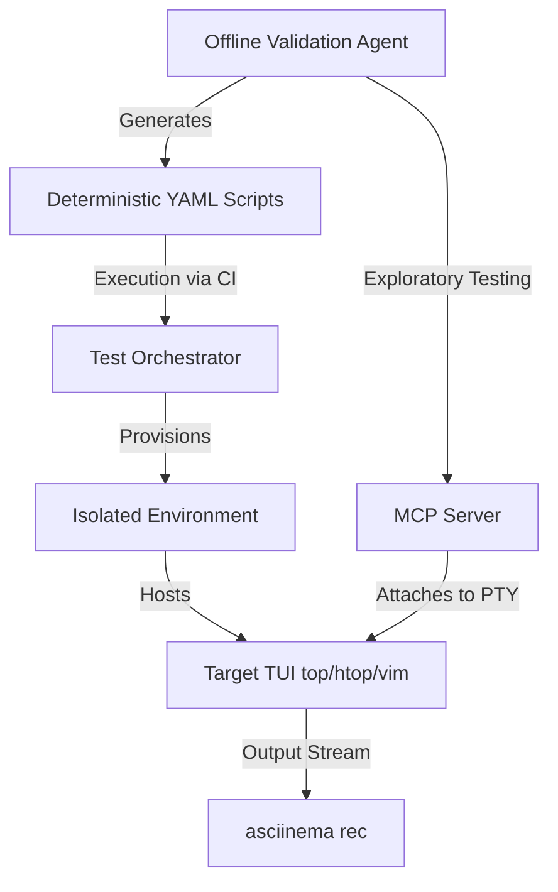

# High-Level Design: Real-World Testing & Video Recording (mcp-tuikit)

## 1. System Overview

The testing architecture for `mcp-tuikit` focuses on validating the MCP server against simpler, highly-available Terminal User Interfaces (TUIs) like `top`, `htop`, `btop`, `vim`, and `nano`. The system relies on isolated environments, seamless session recording, and an automated agentic feedback loop for validation.

## 2. Optional Isolated Test Environments

To ensure tests are deterministic and do not impact the host system, isolation is supported but strictly **optional**. It is controlled via an environment variable.

- **Docker / Podman Isolation:** If the isolation env var is set, the testing suite will spin up ephemeral Docker or Podman containers to host the TUIs (`top`, `vim`, etc.). No Kubernetes is required.
- **PTY Allocation:** The MCP server allocates a pseudo-terminal (PTY) within the container (if isolated) or on the host (if local) to execute the target TUI.
- **Lifecycle Management:** The testing framework handles spinning up the environment, attaching the MCP server, executing the test scripts, and tearing down the container upon test completion or timeout.

## 3. Video and GIF Recording Strategy

Capturing test executions is critical for debugging and documentation.

- **Primary Format (`asciinema`):** Instead of manually intercepting PTY streams, the execution command will be wrapped with `asciinema rec --stdin`. This natively records the TUI session into an `.cast` file format in real-time.
- **GIF/Video Generation:** Post-test, `.cast` files can be rendered into GIFs or MP4s using tools like `agg` (Asciinema GIF Generator) or integrated with `vhs` for stylized output if necessary.
- **Decision:** Wrapping the execution with `asciinema` avoids the complexity of manual stream interception and avoids coupling test execution to video rendering engines (like `vhs`), retaining rich textual data for deep inspection.

## 4. Agentic Validation Feedback Loop

Testing TUI interactions requires asserting complex, dynamic screen states. A secondary `opencode` instance will act as the Validation Agent.

- **Vitest Integration:** The primary testing engine will be `vitest` (handling integration tests within a dedicated directory).
- **Strict DSL Responses:** When an `opencode` instance is spun up to validate a flow, it must respond with a very strict Domain Specific Language (DSL) that `vitest` can reliably parse and assert against.
- **Example DSL:** The agent will output signals like `RUN:OK` or `RUN:BAD REASON: <description of the failure>`.
- **Validation:** This allows `vitest` to treat the LLM as a deterministically parsable assertion engine, checking if the final screen state actually represents what the test intended (e.g. verifying a `vim` save operation worked or `htop` correctly sorted a column).
